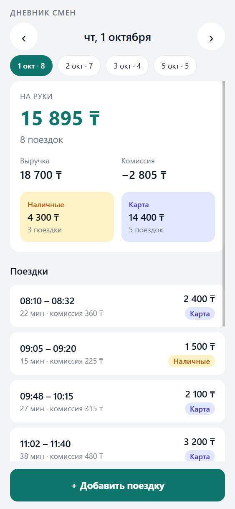
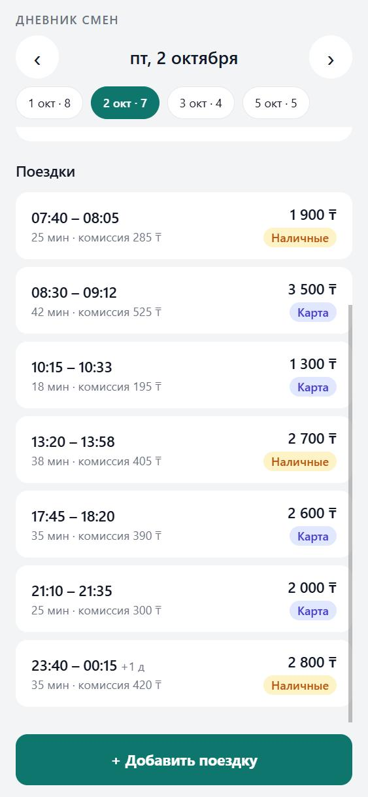
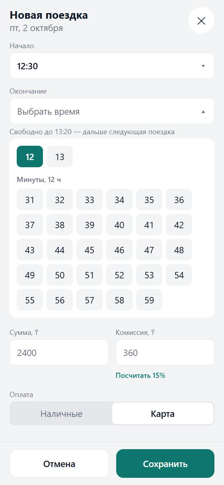
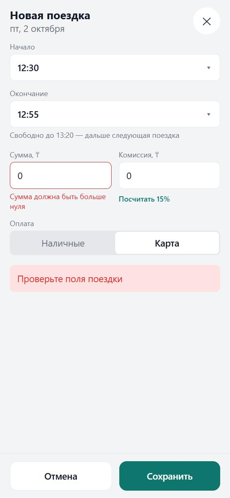

# Дневник смен водителя

Небольшое приложение для водителя такси: поездки за выбранный день, сводка
(выручка, комиссия, «на руки», наличные/карта), переключение дней и добавление
поездки с проверкой данных и защитой от дублей.

- **Сервер:** Node.js + TypeScript + Fastify, тесты на vitest. Данные — JSON-файл.
- **Клиент:** Expo SDK 57 (React Native) + TypeScript + zustand. Один код
  работает в браузере и на телефоне через Expo Go.

<table>
  <tr>
    <td></td>
    <td></td>
    <td></td>
    <td></td>
  </tr>
  <tr>
    <td>Сводка и поездки дня</td>
    <td>Поездка через полночь</td>
    <td>Выбор только свободного времени</td>
    <td>Ошибка проверки от сервера</td>
  </tr>
</table>

## Что сделано

| Требование | Где |
|---|---|
| API: поездки за день и сводка (число поездок, выручка, комиссия, «на руки», наличные/карта) | `GET /v1/days/:date` — [server/src/routes/trips.ts](server/src/routes/trips.ts), расчёт — [daySummary.ts](server/src/domain/daySummary.ts) |
| Клиент: сводка, список, переключение дней | [client/src/screens/DayScreen.tsx](client/src/screens/DayScreen.tsx) — стрелки «‹ ›» и быстрые кнопки дней, где есть поездки |
| Удобное добавление | форма на весь экран, время выбирается «час → минута» только из свободного — [TimePicker.tsx](client/src/components/TimePicker.tsx), расчёт — [freeTime.ts](client/src/domain/freeTime.ts) |
| Добавление с проверкой (сумма > 0, окончание позже начала) | `POST /v1/trips` — [validateTrip.ts](server/src/domain/validateTrip.ts), ошибки подсвечиваются у полей формы |
| Повторная отправка не создаёт дубль | [tripService.ts](server/src/services/tripService.ts), см. раздел «Решения» |
| Тесты на сводку и на дубли | [server/tests](server/tests) — 55 тестов; логика формы — [client/src/domain](client/src/domain), 19 тестов |

## Как запустить

Нужен **Node.js 22.12 или новее**.

**1. Сервер** (API на http://localhost:3000):

```bash
cd server
npm install
npm run dev
```

При первом запуске создаётся рабочий файл `data/trips.json` — копия
`data/trips.seed.json`. Чтобы вернуть исходные данные, удалите `data/trips.json`
и перезапустите сервер.

**2. Клиент в браузере** (http://localhost:8081), во втором терминале:

```bash
cd client
npm install
npm run web
```

**Тесты** — сервер и логика формы клиента:

```bash
cd server
npm test
npm run typecheck
```

```bash
cd client
npm test
npm run typecheck
```

**На телефоне через Expo Go.** Телефон и компьютер — в одной сети Wi-Fi.
Сервер по умолчанию слушает только этот компьютер, поэтому запустите его так:

```bash
HOST=0.0.0.0 npm run dev
```

(в PowerShell: `$env:HOST="0.0.0.0"; npm run dev`). Затем в папке `client` —
`npm start` и отсканируйте QR-код приложением Expo Go (обычная версия из
App Store или Google Play — клиент на актуальном Expo SDK 57). Адрес сервера клиент
возьмёт сам — это компьютер, с которого Expo раздаёт приложение. Если нужен
другой адрес, задайте `EXPO_PUBLIC_API_URL`, например `http://192.168.1.10:3000`.
Если на компьютере включён VPN, Expo может подставить в QR-код адрес VPN —
тогда укажите адрес в Wi-Fi явно: `REACT_NATIVE_PACKAGER_HOSTNAME=192.168.1.10 npm start`.

## API

| Метод | Путь | Ответ |
|---|---|---|
| GET | `/healthz` | `{ "status": "ok" }` |
| GET | `/v1/days` | дни, в которые есть поездки: `[{ "date": "2026-10-01", "tripsCount": 8 }, …]` |
| GET | `/v1/days/:date` | `{ date, tzOffset, summary, trips, busy }` — поездки дня по порядку, сводка и занятое время (см. ниже). Неверная дата → 400 `invalid_date` |
| POST | `/v1/trips` | **201** — создана, **200** — повтор той же поездки (дубль не создан), **400** `validation_failed` — ошибки по полям, **409** `trip_id_conflict` / `trip_overlap` |

Пример сводки за 1 октября:

```json
{
  "tripsCount": 8,
  "revenue": 18700,
  "commission": 2805,
  "net": 15895,
  "byPayment": {
    "cash": { "count": 3, "amount": 4300 },
    "card": { "count": 5, "amount": 14400 }
  }
}
```

Добавление поездки и повтор:

```bash
curl -X POST localhost:3000/v1/trips -H "content-type: application/json" \
  -d '{"id":"a1","start":"2026-10-04T10:00:00+05:00","end":"2026-10-04T10:20:00+05:00","amount":1800,"payment":"cash","commission":270}'
# 201 {"trip":{…},"date":"2026-10-04","created":true}
# тот же запрос ещё раз → 200 {"trip":{…},"date":"2026-10-04","created":false}
```

Ошибка проверки:

```json
{
  "code": "validation_failed",
  "message": "Проверьте поля поездки",
  "fields": {
    "end": "Окончание должно быть позже начала",
    "amount": "Сумма должна быть больше нуля"
  }
}
```

Что проверяется при добавлении: все поля на месте и нужного типа (сумма
строкой `"2400"` — ошибка, а не тихое превращение в число), лишних полей нет;
`amount > 0`, `0 ≤ commission ≤ amount`, не больше двух знаков после запятой;
`start` и `end` — дата и время **с часовым поясом**, существующая дата,
`end` позже `start`; `payment` — `cash` или `card`.

Поле `busy` в ответе дня — занятое время для формы: все поездки, которые
задевают этот и следующий день, в том числе ночная поездка вчерашнего дня,
заходящая за полночь:

```json
"busy": [
  { "tripId": "t15", "start": "2026-10-02T23:40:00+05:00", "end": "2026-10-03T00:15:00+05:00" },
  { "tripId": "t16", "start": "2026-10-03T10:20:00+05:00", "end": "2026-10-03T10:50:00+05:00" }
]
```

## Решения

**Почему поездка через полночь относится к дню начала.** Заказ один и деньги
за него пришли один раз — делить его между двумя днями нельзя. Водитель
думает о смене так же: поездка, взятая в 23:40, — это ещё вчерашняя смена.
День считается по местным часам (+05:00, задаётся `BUSINESS_TZ_OFFSET`), а не
по часам сервера или телефона: иначе поездка в 02:00 по Алматы попала бы во
«вчера», потому что по Гринвичу ещё вечер. Если время прислано в другом поясе,
например по Москве, сервер всё равно переводит его на местные часы.

**Почему деньги считаются в целых числах.** Компьютер хранит дробные числа
неточно: у него 0,1 + 0,2 = 0,30000000000000004. Для сводки за день такие
«хвосты» недопустимы. Поэтому сервер переводит суммы в тиыны (целые числа),
складывает их и только в конце возвращает в тенге. Копейки можно вводить —
до двух знаков после запятой.

**Как работает защита от дублей.** У каждой поездки есть номер (`id`). Его
придумывает приложение один раз, когда водитель открывает форму, и все
повторные отправки идут с этим же номером. Сервер, получив поездку:

- с новым номером — записывает её (ответ 201);
- с уже известным номером и теми же данными — понимает, что это повтор
  (пропала связь, двойное нажатие), и отвечает «уже есть» (200), не создавая
  вторую запись;
- с известным номером, но другими данными — отказывает (409): это не повтор,
  а ошибка, и молча перезаписывать поездку нельзя.

Проверка «есть ли уже такая» и запись идут без пауз между ними, поэтому даже
два одновременных запроса не проскочат оба. Это проверено тестом, и тест
проверен на прочность: если специально вставить паузу между проверкой и записью,
он падает. Номера хранятся вместе с поездками в файле, так что повтор после
перезапуска сервера тоже не создаст дубль.

**Зачем запрет пересечения по времени.** Защита по номеру не поможет, если
приложение номер потеряло (например, водитель закрыл форму и ввёл поездку
заново) — тогда та же поездка придёт под новым номером. Но водитель не может
везти двух пассажиров одновременно, поэтому поездка, которая накладывается по
времени на уже записанную, отклоняется (409), а приложение показывает, с какой
именно. Поездки встык (одна закончилась в 10:30, следующая началась в 10:30)
разрешены.

**Почему JSON-файл, а не база данных.** Задание про JSON-файл, а проверяющему
не нужно ничего устанавливать. Файл перезаписывается через временный: если
сервер упадёт посреди записи, старые данные останутся целыми. Хранилище
спрятано за интерфейсом `TripRepository`, поэтому замена на базу данных не
затронет остальной код.

**Почему время выбирается из списка, а не вводится.** Сначала было два
текстовых поля «ЧЧ:ММ» и галочка «закончилась после полуночи». На телефоне
это неудобно, и легко ввести время, которое уже занято. Теперь водитель
выбирает час, потом минуту, и видит только свободное: занятые минуты скрыты,
окончание сразу ограничено началом следующей поездки («Свободно до 13:20 —
дальше следующая поездка»). Поездка после полуночи — это просто часы из блока
«Час после полуночи», галочка не нужна. Точность — до минуты: в данных есть
времена вроде 08:32, и шаг в 5 минут их бы не позволил. Занятое время берётся
из ответа сервера (`busy`), так что учитывается и ночная поездка вчерашнего
дня, и утренние поездки завтрашнего.

**На какие дни можно добавлять.** На любые: водитель может внести забытую
поездку задним числом или заранее записать завтрашнюю.

**Где живут правила.** Смысловые правила («сумма больше нуля», «конец позже
начала», «без пересечений») проверяет сервер — он источник правды. Приложение
помогает не ошибиться: выбор времени не предлагает занятое, а ответ сервера
показывается у нужного поля. Если время успели занять с другого устройства,
сервер всё равно откажет, а приложение обновит день и выбор времени.

## Настройки сервера

| Переменная | По умолчанию | Что это |
|---|---|---|
| `PORT` | `3000` | порт API |
| `HOST` | `127.0.0.1` | `0.0.0.0` — пускать телефон из локальной сети |
| `DATA_FILE` | `data/trips.json` | рабочий файл с поездками |
| `SEED_FILE` | `data/trips.seed.json` | откуда взять данные при первом запуске |
| `BUSINESS_TZ_OFFSET` | `+05:00` | пояс, по которому считаются дни |
| `CORS_ORIGINS` | `*` | адреса веб-клиента через запятую |

## Устройство

```
data/              исходные поездки (trips.seed.json)
server/src/
  domain/          правила без привязки к HTTP и файлам: сводка, день поездки, проверка, деньги
  storage/         хранилище: в памяти (тесты) и JSON-файл
  services/        добавление с защитой от дублей, отчёт за день
  routes/, http/   маршруты Fastify и единый формат ошибок
server/tests/      тесты
client/src/
  screens/, components/   экран дня, форма на весь экран, выбор времени
  store/           состояние (zustand): выбранный день, форма добавления
  services/        обращения к API — единственное место с сетью
  domain/          свободное время и сборка поездки из формы (с тестами)
  hooks/           варианты времени для формы из занятого времени дня
```

Исходные данные — 24 поездки за 1–5 октября 2026. Первые две (`t1`, `t2`) —
дословно из задания, 4 октября — выходной, `t15` идёт через полночь.

## Что дальше

- Несколько водителей и вход в приложение: сейчас дневник один.
- Редактирование и удаление поездок.
- База данных вместо файла, когда данных станет много.
- Тесты экранов клиента: сейчас автотестами покрыта логика формы (свободное
  время, сборка поездки), а сами экраны проверены вручную в браузере и на телефоне.
- `npm audit` в клиенте показывает предупреждения: они приходят из
  инструментов разработки Expo (командная строка Expo, сборщик Metro) и в само
  приложение не попадают.

## Как использовался ИИ

Проект сделан вместе с Claude (Claude Code): план, код, тесты и проверка в
браузере. Решения и правки принимал человек. Каждая найденная ошибка ИИ — что
было не так, как заметили и как исправили — записана в
[docs/ai-notes.md](docs/ai-notes.md).
